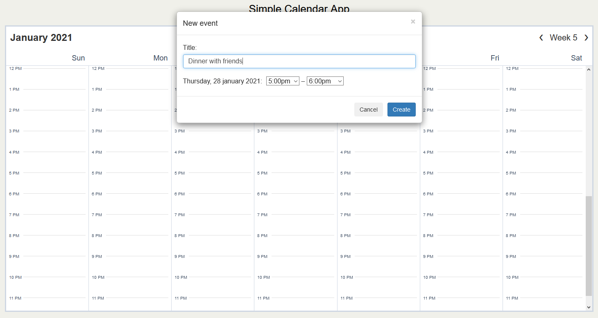
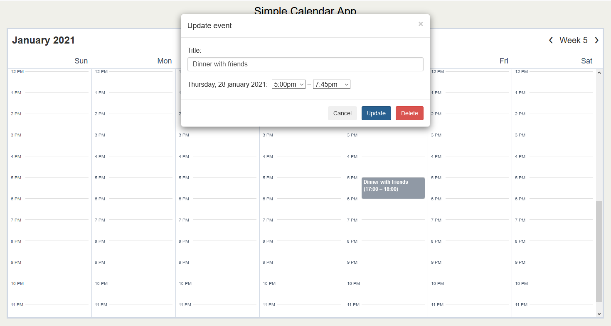

# Simple Calendar App

## About

Simple Calendar App is a demonstration project built with **Laravel 8** and **Vue**. It communicates with [Google Calendar API](https://developers.google.com/calendar/) and contains some basic features: 

- View the primary calendar
- Create a new event in the primary calendar
- Delete an event from the primary calendar
- Update an event in the primary calendar

## Screenshots
*1. Create a new event (click on the calendar)*

*2. Update event (click on the event)*

## Installation

1. Install Google Calendar API:
    * Run **composer require google/apiclient:^2.0**
2. Install Simple Calendar App:
    * Clone the repository with **git clone**
    * Copy **.env.example** to **.env**
    * Run **composer install**
    * Run **php artisan key:generate**
    * Change path in the **require_once** statement (**App\Services\GoogleCalendar.php**)